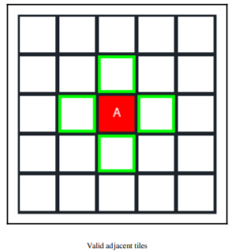

[ENLACE VÍDEO FINAL DE PRÁCTICA](https://youtu.be/kZYh6fCN9e4/)\
[EJECUTABLE FINAL DE PRÁCTICA](https://github.com/iquintasALT/IAV22-QUINTAS_DIZ/releases/tag/Entrega_Final)

# IAV22-QUINTAS_DIZ
Trabajo final para la asignatura de IAV de la UCM.

  

## Propuesta
Mi propuesta es una de los ejemplos en la sección **[Adecuada/Excelente]**. Se trata de un simulador de coches y peatones navegando por una ciudad. Planeo utilizar las siguientes herramientas/algoritmos, aunque estos pueden cambiar a lo largo del desarrollo:

 - Generador de ciudades por celdas con algoritmo A*. Las ciudades serán configurables, permitiendo edificar carreteras y edificios principalmente como el usuario prefiera.
 - Coches siguen sus carriles siguiendo un algoritmo de búsqueda de caminos por puntos. Dependiendo de que me resulte más adecuado, usaré un NavMesh de Unity o implementaré una serie de marcadores que los coches podrán seguir para llegar a sus destinos.
 -  Distintos elementos de trafico: rotondas e intersecciones, con posibles señales, semáforos... Posibles implementaciones; aparcar coches de forma organizada... Todo esto se hará con la herramienta Behaviour Designer.
   - Agentes peatones que cruzan pasos de cebra y navegarán de forma similar a los coches, pero por la acera.
- Posibles añadidos:
	- Generación de mapas aleatorios, tal vez utilizando alguna técnica como ruido de Perlin 

Al ser algo muy modular, cualquier añadido que se me ocurra sobre nuevas tareas para los agentes puede ser implementado fácilmente en un posterior juego, similar a títulos con navegación automática de coches como por ejemplo Simcity o Rollecoaster Tycoon. Si el resultado final se pudiese aplicar para desarrollar un juego entraría dentro de la categoría **[Excelente]**.

# Documentación

Los coches y los peatones tendrán definidos distintos comportamientos marcados por un *Behaviour Tree*. Mediante estos se implementarán diferentes tareas, desde navegar hacia el siguiente objetivo, esperar en una intersección (con o sin semáforos) o parar cuando un peatón este atravesando la calle.

El mapa estará dividido por casillas. Las casillas tendrán varios tipos, VACIO, CARRETERA RECTA, CARRETERA EN CURVA, INTERSECCION... etc. En función del tipo de estructura, existirá un prefab de esa casilla. Los coches podrán navegar por esos prefabs siguiendo unos marcadores:

   

Dependiendo del sentido que siga el coche, seguirá los marcadores en rojo o en azul. Los coches respetarán su carril y seguirán las normas de tráfico. Al ser una implementación bastante modular, añadiré mas tareas si todo funciona correctamente, como por ejemplo adelantar, respetar señales de velocidad o aparcar

## Teoría del algoritmo A*
Para la navegación por carreteras hacia un destino, o para la navegación de peatones por la ciudad, planeo usar el algoritmo de A*. Como ya lo hemos usado anteriormente, voy a repetir la explicación que hicimos en la práctica 2. Cabe destacar que la implementación de este algoritmo variará ligeramente, pero los fundamentos siguen siendo los mismos.

El algoritmo de A* se puede plantear sobre una matriz de celdas como la que voy a plantear. Este algoritmo destaca por su rendimiento, precisión y facilidad de implementación. Se parte de la base de que los agentes que lo navegan conocen de antemano la disposición de los obstáculos y los costes de cada casilla del mapa. 

Aunque tiene sus inconvenientes. Uno de ellos es que si el mapa es demasiado grande, tener en cuenta todo el mapa y explorar todas sus opciones puede resultar costoso. Esto no es un problema para esta práctica, puesto que los mapas son de un tamaño aceptable.

   
   

Para estudiar este algoritmo nos hemos basado en el libro "Unity Artificial Intelligence Programming" (consultar la sección de "Bibliografía"). La explicación que viene en el libro es muy clara, así que vamos a explicarlo de la misma forma.

Se parte de una matriz por casillas. Se tiene una casilla Origen y una casilla Destino. El resto de casillas pueden ser obstáculos o casillas de distintos costes. Para determinar el coste de cada casilla utilizaremos tres variables:
 - G es el coste de ir desde la casilla Origen a la casilla actual.
 - H es el coste ***estimado*** de ir de la casilla actual a la casilla destino, es decir, suponiendo que no hay obstáculos que impidan ir por el camino menos costoso.
 - F es el coste de sumar G y H. Este coste es el que se tendrá en cuenta para elegir el camino más óptimo.
 

   
   

El funcionamiento consiste en lo siguiente. Se comienza en la casilla Origen y se añaden a un vector de casillas no visitadas las adyacentes a la casilla Origen. De las casillas no visitadas se calculan los costes mencionados. Se comprueba cual de ellos es menor y esa casilla pasa a marcarse como visitada. En caso de ser todos los costes iguales se coge en último añadido al vector de no visitados por eficiencia.

Este proceso se vuelve a repetir partiendo de la casilla que se ha marcado como visitada. En caso de encontrar un obstáculo o una casilla que se encuentra fuera de los limites de la matriz, esta casilla no se tendrá en cuenta. Al finalizar todas las llamadas, habremos visitado todas las componentes conexas, es decir, aquellas casillas que sean accesibles desde la casilla Origen. Si la casilla destino es alcanzable, habremos obtenido el camino más óptimo. 

   
  
    

Cada casilla guarda información sobre la casilla anterior desde la que fue alcanzada, con lo que podemos reconstruir el camino óptimo.

   
   

De forma similar a la última práctica, creare un menú para facilitar ver los comportamientos de los vehículos o peatones. Haciendo clic sobre uno de ellos, se podrá ordenar a una entidad en específico una tarea de las mencionadas anteriormente.

# Como ha sido el desarrollo

## Puntos que se evalúan en el video
A - Mostrar constructor de ciudad \
B - Mostrar tamaño variable de mapa \
C - Mostrar grafo en la escena \
D - Mostrar peatones caminando \
E - Funcionamiento con varias entidades y añadidos
## Desarrollo
Las clases más importantes son:
- Para la construcción de la ciudad modular.... \
-- Grid.cs => Representa internamente el grid de tipos de cada celda. Los tipos son Empty, Road y House. \
-- GridManager.cs => Inicializa el grid. Contiene además los gameObjects colocados. Se encarga de todo lo relacionado con colocar casillas: crear carreteras, corregir su orientación, modificar carreteras si se han añadido otras alrededor y colocar casas. \
-- GridSearch.cs => Contiene el algoritmo de A* adaptado a la practica. \
- Para la IA de los peatones... \
-- RoadPoint.cs => Puntos contenidos en los prefabs de carreteras para formar el grafo no dirigido. \
-- AdjacencyGraph.cs => Grafo de RoadPoints que utiliza una variación de A* utilizando elementos de la clase Vertex.cs	 \
-- Pedestrian.cs => Clase que recorre una serie de puntos dados. \
-- PedestrianManager.cs => Crea el grafo para cada agente y lo muestra en la escena de Unity. \

## Representación del grafo

  

## Problemas
Me he visto bastante apurado de tiempo por tener problemas con la implementación básica de caminos, tanto de estructuras de carreteras como con el grafo de puntos recorrido por los peatones (utilizando A*). Es por ello que no me ha dado tiempo ha implementar vehículos como agentes que naveguen este grafo. Aunque la mayor parte del trabajo ya esta hecho, puesto que funcionarían igual que con los peatones, pero con una serie de puntos diferentes.

Dado que el principal trabajo hecho en la practica es la navegación de los peatones, no he utilizado *Behaviour Tree* puesto que únicamente tendría una acción muy grande, lo que va un poco en contra de la idea de utilizar esta estructura.

## Recursos
-- Carreteras modulares: https://quaternius.itch.io/lowpoly-modular-street \
-- Animación peatones: https://www.mixamo.com/ \
-- Coches con IA de aprendizaje automático: https://www.youtube.com/watch?v=2X5m_nDBvS4 \
*(Esto es algo que me pareció muy chulo pero que no está en la práctica porque en ese caso no tendría que hacer yo la IA :) . Lo adjunto por curiosidad.
